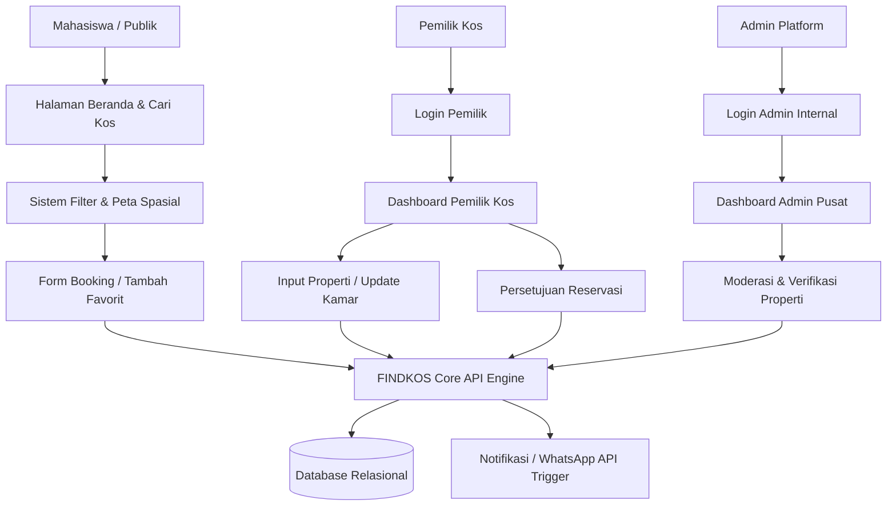
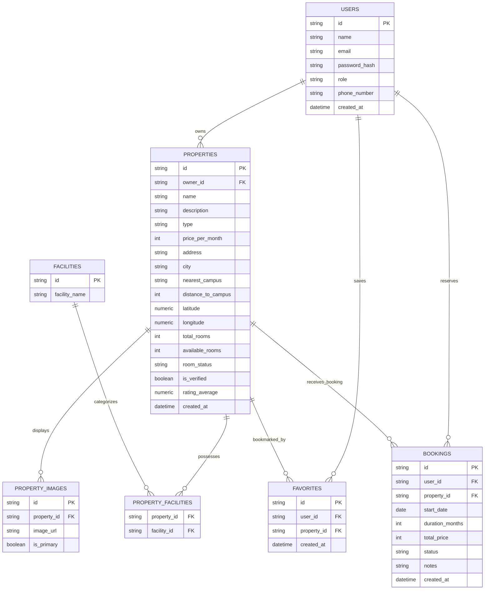

# PRD — Project Requirements Document

## 1. **Overview**

Aplikasi ini adalah platform pencarian dan pemesanan (*booking*) kos terintegrasi berbasis web bernama **FINDKOS**. Sistem ini dirancang untuk menyelesaikan kendala utama mahasiswa perantau dalam mencari hunian, serta membantu pemilik kos memasarkan properti mereka secara efektif. Berbeda dengan sistem *multitenant* murni komersial, platform ini menggunakan isolasi data berbasis *role* di mana pemilik kos mengelola propertinya sendiri, mahasiswa melakukan pencarian secara publik, dan tim internal bertindak sebagai administrator pusat.

Masalah utama yang diselesaikan:

* Mahasiswa kesulitan mencari kos sesuai kebutuhan karena informasi tidak lengkap dan tidak akurat.
* Harus datang langsung ke banyak lokasi yang membuang waktu, biaya, dan tenaga.
* Tidak adanya kepastian ketersediaan kamar secara *real-time*.
* Pemilik kos kesulitan menjangkau ribuan mahasiswa potensial secara digital.

Tujuan utama aplikasi:
* Menyediakan Landing Page utama platform yang informatif dan memiliki nilai konversi tinggi.
* Menyediakan sistem pencarian, penyaringan (*filter*), dan visualisasi peta kos di sekitar kampus.
* Memungkinkan mahasiswa melakukan reservasi (*booking*) langsung secara online.
* Menyediakan Dashboard Admin bagi pemilik kos untuk mengelola listing properti dan memantau ketersediaan kamar.
* Mendukung verifikasi manual oleh admin platform untuk menjamin keakuratan data lapangan.

---

## 2. **Requirements**
* Sistem harus memisahkan hak akses dengan jelas menggunakan tiga *role*: Mahasiswa, Pemilik Kos, dan Admin Platform.
* Setiap Pemilik Kos dapat mendaftarkan satu atau lebih properti kos.
* Setiap kos dapat memiliki detail tipe, harga, fasilitas, koordinat lokasi, dan foto properti.
* Mahasiswa (Publik) dapat menjelajahi beranda, mencari kos berdasarkan nama/lokasi, serta menerapkan filter kompleks tanpa harus login terlebih dahulu.
* Sistem wajib menyediakan indikator ketersediaan kamar secara *real-time* ("Tersedia", "Terbatas", "Habis").
* Mahasiswa wajib melakukan login/registrasi akun hanya ketika ingin mengakses fitur "Favorit Saya" (*wishlist*) dan mengajukan pemesanan (*booking*).
* Sistem harus melacak status pemesanan secara eksplisit (`pending`, `approved`, `rejected`, `cancelled`).
* Pemilik kos dapat mengelola status ketersediaan kamar langsung dari dashboard mereka.
* Admin Platform memiliki hak akses penuh untuk melakukan verifikasi properti sebelum ditayangkan secara publik demi menjaga keabsahan data.
* Desain antarmuka (UI) wajib *mobile-first* dan responsif (mendukung visualisasi Desktop Web dan Mobile Web) mengingat target pengguna dominan menggunakan ponsel.
* MVP difokuskan pada integrasi tautan langsung (*direct link*) seperti WhatsApp Link/API untuk mempercepat proses komunikasi dan transaksi sebelum diintegrasikan dengan *payment gateway* otomatis.

---

## 3. **Core Features**
### Landing Page Utama Platform (Beranda)
* **Hero Section Search**: Form pencarian lokasi/nama kos, filter cepat tipe kos, dan input rentang harga maksimal.
* **Statistik Platform**: Komponen interaktif yang menampilkan jumlah mahasiswa aktif, jumlah kos, dan jumlah kampus terjangkau.
* **Rekomendasi Kos Populer**: Grid kartu produk kos pilihan yang menampilkan gambar, badge status kamar, tipe kos, alamat/jarak kampus, rating bintang, harga, dan tombol detail.
* **Value Proposition Card**: Informasi keunggulan utama ("Terverifikasi & Aman", "Real-time Availability", "Pembayaran Terjamin").
* **CTA Pemilik Kos**: Banner promosi untuk mengajak pemilik kos mendaftarkan properti mereka.
* **Section Tentang Kami**: Profil singkat misi sosial platform FINDKOS beserta kutipan CEO.

### Halaman Cari Kos (Pencarian & Filter)
* **Sistem Penyaringan Properti**: Komponen filter berdasarkan tipe kos (Putra/Putri/Campur), rentang harga slider, dan checkbox fasilitas (Wi-Fi, AC, Dapur Luar, Termasuk Listrik).
* **Sorting Engine**: Fitur mengurutkan hasil pencarian berdasarkan harga terendah/tertinggi dan rating bintang.
* **Peta Interaktif (Google Maps/Leaflet)**: Visualisasi pin lokasi kos di dekat kampus strategis. Pada mobile diakses via floating button "Lihat Peta".

### Dashboard Pemilik Kos
* **Manajemen Listing**: Form multi-step untuk menambah, mengubah, atau menonaktifkan properti kos (unggah foto, input fasilitas, koordinat lokasi, deskripsi).
* **Manajemen Kamar & Availability**: Input manual jumlah total kamar serta pembaruan berkala kamar kosong untuk indikator *real-time* di web utama.
* **Manajemen Booking**: Panel untuk melihat pengajuan sewa dari mahasiswa, mengambil tindakan (setujui/tolak), dan histori pemesanan.

### Dashboard Admin Platform
* **Verifikasi Properti**: Modul moderasi untuk memeriksa listing baru yang didaftarkan pemilik kos sebelum dipublikasikan.
* **User Directory**: Pengelolaan data pengguna terdaftar (mahasiswa dan pemilik kos).

### Halaman Favorit & Interaksi Publik
* **Wishlist Manager**: Menyimpan daftar kos favorit mahasiswa yang dilengkapi sub-filter kategori dan fitur pencarian internal.
* **Hubungi Kami & FAQ**: Formulir kontak interaktif, accordion FAQ, serta widget bantuan cepat terhubung ke WhatsApp Business dan email dukungan.

---

## 4. **User Flow**
### Flow Mahasiswa (Pencari Kos)
1. Mahasiswa membuka website FINDKOS (Landing Page).
2. Mahasiswa mengetik lokasi atau nama kampus di search bar hero section.
3. Sistem mengarahkan ke Halaman Cari Kos dan menampilkan daftar properti yang relevan.
4. Mahasiswa menerapkan penyaringan berdasarkan tipe kos, budget harga, dan fasilitas pendukung.
5. Mahasiswa mengklik "Lihat Detail" pada kartu kos untuk melihat deskripsi, peta, ulasan, dan ketersediaan kamar.
6. Jika berminat, mahasiswa mengklik tombol "Booking" atau tombol "Favorit" (Sistem meminta login/register jika sesi belum aktif).
7. Mahasiswa mengisi formulir pengajuan sewa (tanggal masuk, durasi sewa, dan catatan tambahan).
8. Sistem membuat entri transaksi baru dengan status `pending`.
9. Mahasiswa diarahkan ke halaman instruksi lanjutan atau dapat mengklik widget WhatsApp untuk melakukan komunikasi instan dengan pemilik.

### Flow Pemilik Kos
1. Pemilik kos mengunjungi platform dan memilih menu "Daftar Sebagai Pemilik".
2. Pemilik membuat akun dan login menuju Dashboard Pemilik Kos.
3. Pemilik mengisi profil bisnis dan melengkapi formulir pendaftaran properti kos baru.
4. Listing masuk ke antrean moderasi Admin Platform dengan status awal belum terverifikasi.
5. Setelah disetujui Admin, properti aktif dan tayang secara publik di hasil pencarian web.
6. Pemilik secara berkala memperbarui ketersediaan kamar kosong jika ada penghuni yang keluar/masuk.
7. Pemilik menerima notifikasi atau daftar pengajuan sewa dari mahasiswa, memeriksa profilnya, dan mengubah status menjadi `approved` atau `rejected`.

---

## 5. **Architecture**

Aplikasi menggunakan arsitektur full-stack modern terpisah (*decoupled architecture*) atau monolitik modern menggunakan framework full-stack untuk efisiensi tim skala kecil. Backend/API menangani autentikasi multi-role, manipulasi data properti, algoritma pencarian spasial, dan manajemen state ketersediaan kamar. Database menyimpan relasi entitas secara terisolasi berdasarkan pengenal pengguna.

Komponen utama:

* **Responsive Web Presentation Layer**: Navigasi bar adaptif (desktop top-navbar, mobile bottom-bar) untuk konsistensi pengalaman pengguna.
* **Search & Filtering Engine**: Kueri pencarian fleksibel untuk memproses pencarian berdasarkan teks, harga, tipe, dan array fasilitas.
* **Role Isolation & Access Control**: Sistem pengaman rute (*middleware*) untuk memastikan pemilik tidak dapat memodifikasi properti milik orang lain dan mahasiswa tidak dapat masuk ke panel admin.
* **Availability State Tracker**: Logic yang memicu perubahan otomatis badge status ("Tersedia" -> "Terbatas" -> "Habis") berdasarkan kuantitas kamar kosong di database.

---

## 6. **Database Schema**

Berikut adalah struktur basis data relasional tingkat tinggi (*High-Level Schema*) untuk pengembangan FINDKOS menggunakan pendekatan SQL:

### `users`

Menyimpan seluruh data dasar pengguna platform.

* `id` — text/uuid, Primary Key.
* `name` — text, nama lengkap pengguna.
* `email` — text, alamat email unik.
* `password_hash` — text, hash sandi untuk otentikasi.
* `role` — text, tingkatan akses: `mahasiswa`, `pemilik`, `admin`.
* `phone_number` — text, nomor ponsel/WhatsApp aktif.
* `created_at` — datetime, pencatatan waktu pembuatan akun.

### `properties`

Menyimpan data induk properti kos yang didaftarkan pemilik.

* `id` — text/uuid, Primary Key.
* `owner_id` — text/uuid, Foreign Key merujuk ke `users.id`.
* `name` — text, nama properti kos (e.g., "Kos Arwana Dago").

* `description` — text, penjelasan mendetail mengenai properti.
* `type` — text, jenis kos: `putra`, `putri`, `campur`.

* `price_per_month` — integer, nominal biaya sewa bulanan dalam Rupiah.

* `address` — text, alamat fisik lengkap.

* `city` — text, kota lokasi properti (e.g., "Bandung").

* `nearest_campus` — text, nama kampus terdekat (e.g., "ITB").

* `distance_to_campus` — integer, estimasi jarak ke kampus terdekat dalam satuan meter.

* `latitude` — numeric/double, koordinat lintang untuk pemetaan.
* `longitude` — numeric/double, koordinat bujur untuk pemetaan.
* `total_rooms` — integer, jumlah kapasitas seluruh kamar kos.
* `available_rooms` — integer, jumlah sisa kamar kosong saat ini.
* `room_status` — text, kategori ketersediaan: `tersedia`, `terbatas`, `habis`.

* `is_verified` — boolean, status verifikasi kelayakan oleh admin platform.

* `rating_average` — numeric, akumulasi rata-rata nilai ulasan dari mahasiswa.

* `created_at` — datetime, waktu pembuatan listing.

### `facilities`

Menyimpan kamus pustaka fasilitas kos yang tersedia di platform.

* `id` — text/uuid, Primary Key.
* `facility_name` — text, nama fasilitas (e.g., `wifi`, `ac`, `dapur_luar`, `listrik_termasuk`).

### `property_facilities`

Tabel jembatan penghubung relasi *Many-to-Many* antara kos dan fasilitas.

* `property_id` — text/uuid, Foreign Key merujuk ke `properties.id`.
* `facility_id` — text/uuid, Foreign Key merujuk ke `facilities.id`.

### `property_images`

Menyimpan galeri URL foto untuk tiap properti kos.

* `id` — text/uuid, Primary Key.
* `property_id` — text/uuid, Foreign Key merujuk ke `properties.id`.
* `image_url` — text, alamat URL file gambar di cloud storage.
* `is_primary` — boolean, penanda gambar utama yang muncul pada card beranda.

### `favorites`

Menyimpan relasi data kos yang disimpan ke menu favorit oleh mahasiswa.

* `id` — text/uuid, Primary Key.
* `user_id` — text/uuid, Foreign Key merujuk ke `users.id` (hanya role mahasiswa).
* `property_id` — text/uuid, Foreign Key merujuk ke `properties.id`.
* `created_at` — datetime, waktu penambahan favorit.

### `bookings`

Menyimpan transaksi atau reservasi pengajuan kos.

* `id` — text/uuid, Primary Key.
* `user_id` — text/uuid, Foreign Key merujuk ke `users.id` (pencari kos).
* `property_id` — text/uuid, Foreign Key merujuk ke `properties.id`.
* `start_date` — date, tanggal rencana mulai menempati kos.
* `duration_months` — integer, durasi sewa yang diajukan (dalam hitungan bulan).
* `total_price` — integer, total kalkulasi harga sewa.
* `status` — text, status sewa: `pending`, `approved`, `rejected`, `cancelled`.
* `notes` — text, pesan opsional tambahan dari penyewa.

* `created_at` — datetime, waktu pengajuan pemesanan.

---

## 7. **Tech Stack**

Rekomendasi susunan teknologi (*tech stack*) untuk mengimplementasikan MVP platform FINDKOS secara optimal:

* **Framework Full-stack / Front-end**: Next.js (App Router)
  - Next.js sangat direkomendasikan karena mendukung *Server-Side Rendering* (SSR) yang krusial untuk performa SEO pada Landing Page utama dan halaman detail kos publik, dikombinasikan dengan API Routes untuk menyederhanakan arsitektur backend dalam satu repositori.

* **Styling & UI Utility**: Tailwind CSS + Radix UI / shadcn/ui
  - Mempercepat pembangunan antarmuka bergaya kartu (*card*) dan komponen filter yang responsif secara visual, serta menyediakan komponen bawaan modular seperti Accordion untuk FAQ, Modal Dialog untuk Booking, dan Sheet Sidebar untuk menu filter mobile.

* **State Management & Data Fetching**: TanStack Query (React Query) + Axios
  - Mengelola sinkronisasi data dari client ke API Server, menangani *caching* list pencarian properti, serta manajemen state asinkronus saat menerapkan filter tanpa memicu re-render halaman penuh.

* **Database & Backend Services**: Supabase (PostgreSQL)
  - Menyediakan database relasional PostgreSQL siap pakai dengan performa tinggi untuk mengelola relasi kompleks multi-tabel (user, properti, fasilitas, dan booking).
  - Mendukung ekstensi spasial **PostGIS** bawaan di Supabase jika ke depan sistem pencarian ingin ditingkatkan menggunakan kalkulasi radius koordinat geografis yang presisi dari titik kampus.

* **Object Relational Mapper (ORM)**: Prisma atau Drizzle ORM
  - Membantu pemetaan skema database Supabase ke tipe data objek (TypeScript) dengan fitur migrasi skema yang aman dan terstruktur.

* **Authentication & Authorization**: Supabase Auth
  - Menangani pendaftaran, login, dan manajemen sesi berbasis peran (*role-based authorization* untuk Mahasiswa & Pemilik Kos).
  - Mendukung opsi login cepat via Google OAuth demi kemudahan akses generasi digital mahasiswa.

* **File & Image Storage**: Supabase Storage
  - Menggunakan satu ekosistem yang sama untuk menyimpan galeri foto kos yang diunggah pemilik.
  - Memanfaatkan fitur bucket publik guna menghasilkan URL gambar properti secara instan untuk disimpan di tabel database.

* **Cloud Deployment Platform**: Vercel
  - Infrastruktur serverless yang stabil dan memiliki performa CDN global terbaik untuk mendeploy dan menghosting aplikasi Next.js.